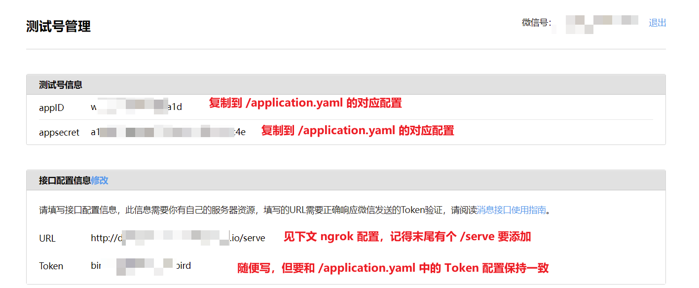
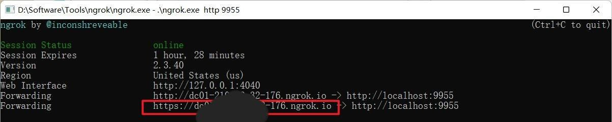
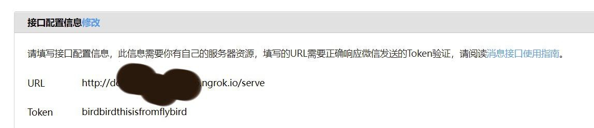

# 环境建立与排错

## 采用环境

- [wechat golang api 库](https://github.com/silenceper/wechat)

其中 以上项目 README.md 呈现了相应的环境配置方法 甚至简单的使用用例

PS: **需要注意** 如果遇到 微信 API 并未实现的 可参照对应的 API 规则进行请求

- [wechat API official Document](https://developers.weixin.qq.com/doc/offiaccount/Getting_Started/Overview.html)

## 配置文件

[配置文件 样本](../application.example.yaml)
需要重命名为 [application.yaml](../application.yaml)

## 项目初始化 

请注意在 go 1.17 或者以上版本的情况下进行处理

在项目的环境情况下 (存在 go.mod) 进行 `go mod tidy` 操作 

会自动从远程拉取项目 若遇到 404、 timeout 等错误 可能是您的代理爆炸了

您需要检查 代理配置 


## 微信公众号测试

前往 https://mp.weixin.qq.com/debug/cgi-bin/sandbox?t=sandbox/login 申请测试公众号，  
在网页内填写相应信息，并修改对应的配置，详见下图：  
  
下为 `/application.yaml` 的 `wechat` 配置部分  
```yaml
wechat:
  appID: ...见图描述
  appSecret: ...见图描述
  token: ...见图描述
  encodingAESKey: ... 留空即可
```

Just like [文档](https://silenceper.com/wechat/officialaccount/start.html) 中所提到的
在部署 测试性质服务器的时候 可以使用 ngrok 类的反向代理 生成一个 反代 然后使用自己的本地启动的服务来进行公众号的调试

如果您有自己的服务器域名 与 SSL 证书可以完全使用正常的服务器进行测试 (要求略高) 当然这也更加相近与目前助手的服务器配置

### 这里是小小的 ngrok 使用演示 
[ngrok Win amd64.exe](https://bin.equinox.io/c/4VmDzA7iaHb/ngrok-stable-windows-amd64.zip) 下载完毕 这个二进制之后 

操作如下 所示

- setup the ngrok 
  - command line: .\ngrok.exe http 9955 # 请注意 这里 9955 是根据你的 application.yaml 中 httpEngine port 规定的 example 中是 9955
- config the url like 
  - **请注意** 默认的 api 位置在 /serve 下 (根据 [代码](https://github.com/hduhelp/wechat_mp_server/blob/12149708bbe46fd3ef62841224f6f6700b760501/server/messageHandler.go#L110o) 110 行 serve() 函数的定义)

然后启动本项目就完事了 api 域名的验证 数据库的启动就都完成了


## 开发注意事项 FAQ

Q:

A:


