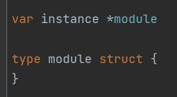

# 
 组件注册逻辑介绍文档

#### 已下是我对组件注册逻辑的理解，若有错误，请大佬们指正

* 如何自定义组件

  1. 在项目 module 文件夹下新建一个包，包名使用驼峰命名法，例如 myTest。

  2. 在包中新建 init.go 文件

     

     

  3. 在 init.go 中必须 import 的包有 `wechat_mp_server/server` 和 `sync` ,其余按照功能需求引入。

  4. 在 init.go 中，首先声明一个名为 module 的类型，可以根据需要添加字段或者为空。然后定义一个 module 类型的指针 instance。

        

  5. 一个 module 类型必须实现以下6个方法

     + GetModuleInfo() : 用于获取模块信息。返回值为 `server.ModuleInfo` 类型，

       ​									其中包含模块 ID 和一个 module 实例指针.

     + Init(): 第一次模块初始化。进行 transfer 的初始化，获取时间，启动定时任务等等。或者   

       ​            留空。

     + PostInit(): 第二次初始化。(暂时不知道是做什么的)

     + Serve(): 在此实现模块的服务逻辑。进行消息和事件的处理，设置路由等。

     + Start(): 启动模块。可以通过 `defer sentry.Recover()` 捕捉错误。

     + Stop(): 在其中通过 `defer wg.Done()` 在函数完成时将等待组数值减一。

     + 一个 module 类型实现了以上6个方法，就实现了 Module 接口(下述)。
     
  6. 定义 init 函数。init 函数在模块被导入的时候会自动执行，用于包的初始化。在其中要先实例化一个 module实例指针 并赋值给 instance, 然后调用 server 的 `server.RegisterModule(instance)` 方法即可完成组件的注册。
  
        	
        
          
  
  
  7. 在 main.go 中导入自己的模块即可(注释掉某个模块的导入语句即可禁用该模块)。

* 组件注册逻辑讲解

  1. 首先看几个比较重要的接口和类型的定义：

     - Module : 一个声明了 GetModuleInfo()、Init()、PostInit()、Serve()、Start()、Stop() 方法的接口。任何自定义 module 都需要实现 Module 接口。(server/module.go)

     - ModuleInfo: 一个包含模块信息和组件实例的结构体：(server/moduleId.go)

       ​	
       
     - Modules: 一个以 string 为 key, ModuleInfo 为 value 的全局字典，在 module.go 中定义。
     
       用于维护所有已注册模块的模块名称 -> 模块信息的映射。
     
       
     
  2. 组件注册和启动的内部原理
  
     - 模块的注册
  
       当组件在 main.go 中被导入以后，组件 init() 函数自动执行，完成 module 实例的创建并调用
  
       `server.RegisterModule(instance)` 方法。那么在 `RegisterModule()` 里干了什么事情呢？如图：
  
       
  
       到此模块注册完成。
  
       
  
     - 模块的启动
  
       模块启动是通过 `server.StartService()` 函数进行的(server/server.go)。
  
       StartService() 函数首先遍历 Modules, 调用每个组件的 Init() 和 PostInit() 方法, 完成所有组件初始化。
  
       
  
       接下来循环调用每个组件的 Serve() 方法，进行消息和事件处理的注册。
  
       
  
       
  
       最后调用每个组件的 Start()。至此所有组件注册并启动完成。
