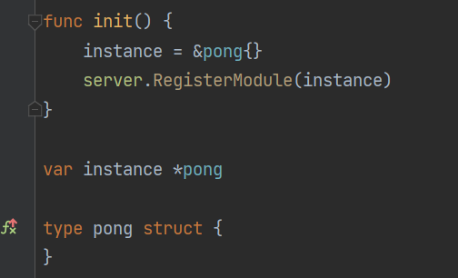
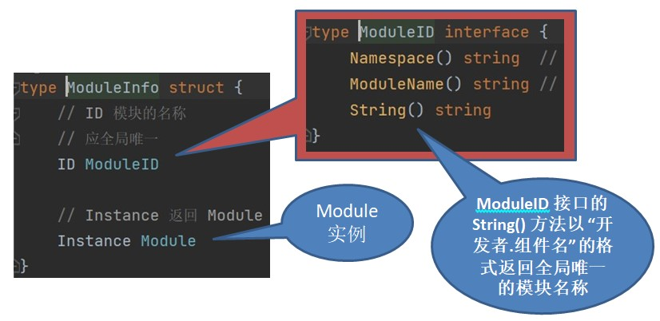
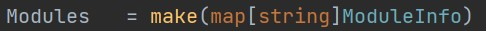
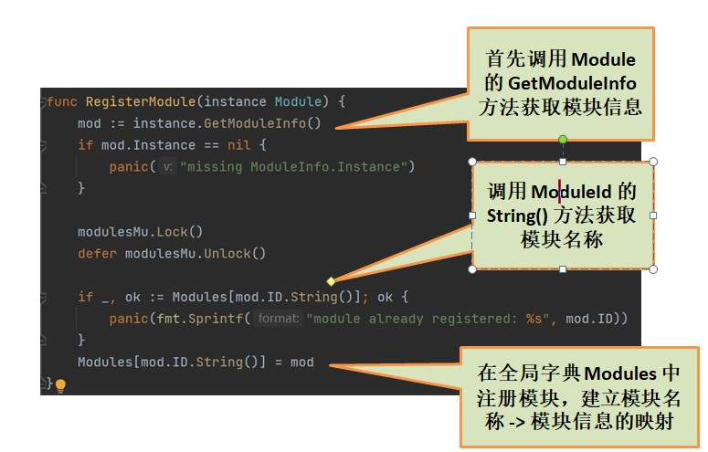
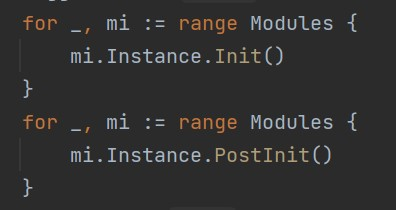
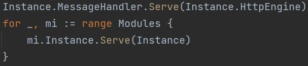

# 
 组件注册逻辑介绍文档 

## 如何自定义组件

  1. 在项目 module 文件夹下新建一个包，包名建议使用驼峰命名法，例如 myTest。

  2. 在包中新建模块入口文件，如 `init.go`
  3. **定义模块核心结构，实现模块注册**
     1. 在模块入口文件，定义一个实现了 [Module接口](../server/module.go)的类型，如 `pong`，可以根据需要自定义模块内部字段。
     2. 定义一个指针 `instance` 指向 `pong`，并在 `init()` 函数内调用 `server.RegisterModule()`函数完成模块注册第一步，如图：
     
     3. 在 [main.go](../server/main.go) 中以 `import _` 的形式引入模块包，完成模块注册第二步。（同理，注释或删除 `import _` 语句即可实现模块卸载）
  4. **填充模块接口方法**：`Module` 接口定义了以下几个方法：这里只做简单介绍，详细使用说明见 [代码注释](../module/wechatPong/init.go)。

     + GetModuleInfo() : 用于获取模块信息。一般照抄，修改模块名称和相应字符串即可

     + Init(): 第一次模块初始化。初始化本模块内部的内容。

     + PostInit(): 第二次初始化。主要做跨模块初始化工作。

     + Serve(): 在此实现模块的服务逻辑。进行消息和事件的处理，设置路由等。

     + Start(): 模块启动。此方法会被新开协程执行。

     + Stop(): 项目被关闭后执行的操作。**注意： `defer wg.Done()` 必不可少**。

## 组件注册逻辑讲解

  1. 首先看几个比较重要的接口和类型的定义：

     - Module : 一个声明了 GetModuleInfo()、Init()、PostInit()、Serve()、Start()、Stop() 方法的接口。任何自定义 module 都需要实现 Module 接口。(server/module.go)

     - ModuleInfo: 一个包含模块信息和组件实例的结构体：(server/moduleId.go)

       
       
     - Modules: 一个以 string 为 key, ModuleInfo 为 value 的全局字典，在 module.go 中定义。
     
       用于维护所有已注册模块的模块名称 -> 模块信息的映射。
     
       
     
  2. 组件注册和启动的内部原理
  
     - 模块的注册
     
       语法知识点：`import _` 语句会执行被引用包的 `init()` 函数，并将包中的所有变量导出到当前包中。  

       所以当模块在 main.go 中被导入以后，模块 `init()` 函数自动执行，完成 module 实例的创建并调用
  
       `server.RegisterModule(instance)` 方法。那么在 `RegisterModule()` 里干了什么事情呢？如图：
  
       
  
       到此模块注册完成。
     
     - 模块的启动
  
       模块启动是通过 `server.StartService()` 函数进行的(server/server.go)。
  
       StartService() 函数首先遍历 Modules, 调用每个组件的 Init() 和 PostInit() 方法, 完成所有组件初始化。
  
       
  
       接下来循环调用每个组件的 Serve() 方法，进行消息和事件处理的注册。
  
       
     
       最后调用每个组件的 Start()。至此所有组件注册并启动完成。
